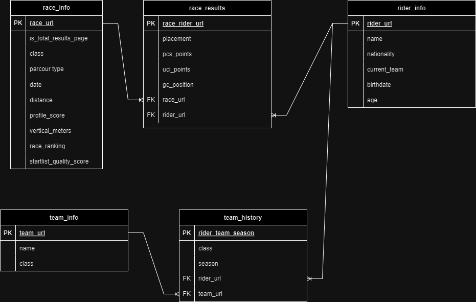

# Cycling database

## ER Diagram

## Schema

### race_info

- **race_url**: `VARCHAR(255)` PRIMARY KEY
- **is_total_results_page**: `BOOL`
- **class**: `TEXT`
- **parcour_type**: `TEXT`
- **date**: `DATE`
- **distance**: `FLOAT`
- **profile_score**: `FLOAT`
- **vertical_meters**: `FLOAT`
- **race_ranking**: `INT`
- **startlist_quality_score**: `INT`

### race_results

- **race_rider_url**: `VARCHAR(255)` PRIMARY KEY
- **race_url**: `VARCHAR(255)` FOREIGN KEY REFERENCES race_info.race_url
- **rider_url**: `VARCHAR(255)` FOREIGN KEY REFERENCES rider_info.rider_url
- **placement**: `INT`
- **pcs_points**: `INT`
- **uci_points**: `INT`
- **gc_position**: `INT`

### rider_info

- **rider_url**: `VARCHAR(255)` PRIMARY KEY
- **name**: `TEXT`
- **nationality**: `TEXT`
- **current_team**: `VARCHAR(255)` FOREIGN KEY REFERENCES team_info.team_url
- **birthdate**: `DATE`
- **age**: `INT`

### team_info

- **team_url**: `VARCHAR(255)` PRIMARY KEY
- **name**: `TEXT`
- **class**: `TEXT`

### team_history

- **rider_team_season**: `VARCHAR(255)` PRIMARY KEY
- **rider_url**: `VARCHAR(255)` FOREIGN KEY REFERENCES rider_info.rider_url
- **team_url**: `VARCHAR(255)` FOREIGN KEY REFERENCES team_info.team_url
- **class**: `TEXT`
- **season**: `INT`